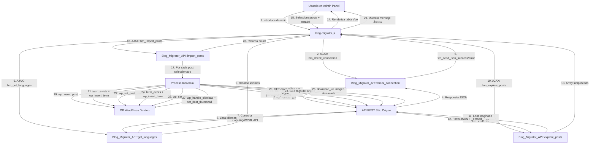

# 🔍 Auditoría Completa: Blog Migrator Plugin

**Fecha:** 2026-02-16  
**Versión analizada:** 0.1  
**Auditor:** Senior WordPress Plugin Engineer

---

## 📋 Resumen Ejecutivo

El plugin **Blog Migrator** es una herramienta para migrar posts desde un sitio WordPress externo utilizando su API REST. A continuación se detalla el funcionamiento completo, el bug crítico detectado y los riesgos identificados.

---

## 🏗️ A) Arquitectura y Flujo Completo

### Estructura del Plugin

```
blog-migrator/
│
├── blog-migrator.php          # Archivo principal (bootstrap)
├── includes/
│   └── class-blog-migrator-api.php   # Clase principal (lógica backend)
├── admin/
│   └── admin-page.php         # Vista HTML/Vue template
└── assets/
    └── blog-migrator.js       # Aplicación Vue 3 (frontend)
```

### Diagrama de Flujo Completo



### Flujo Detallado Paso a Paso

#### **1️⃣ UI/Admin Layer** ([admin-page.php](file:///e:/00_APPS_KINSTA/public/plugins-dev/wp-content/plugins/blog-migrator/admin/admin-page.php))
- Template HTML con Vue 3 montado en `#app`
- Campos: dominio, idioma, tabla de posts
- Botones: comprobar conexión, detectar idiomas, explorar, importar

#### **2️⃣ Frontend Layer** ([blog-migrator.js](file:///e:/00_APPS_KINSTA/public/plugins-dev/wp-content/plugins/blog-migrator/assets/blog-migrator.js))
- Aplicación Vue 3 con Composition API
- Gestiona estado reactivo: `domain`, [posts](file:///e:/00_APPS_KINSTA/public/plugins-dev/wp-content/plugins/blog-migrator/includes/class-blog-migrator-api.php#119-244), `connected`, [languages](file:///e:/00_APPS_KINSTA/public/plugins-dev/wp-content/plugins/blog-migrator/includes/class-blog-migrator-api.php#31-73)
- Envía peticiones AJAX con `FormData` a `admin-ajax.php`
- Incluye `nonce` de seguridad en cada request

#### **3️⃣ Backend Layer** ([class-blog-migrator-api.php](file:///e:/00_APPS_KINSTA/public/plugins-dev/wp-content/plugins/blog-migrator/includes/class-blog-migrator-api.php))

**Métodos disponibles:**

| Método | Acción AJAX | Función |
|--------|-------------|---------|
| [check_connection()](file:///e:/00_APPS_KINSTA/public/plugins-dev/wp-content/plugins/blog-migrator/includes/class-blog-migrator-api.php#9-30) | `bm_check_connection` | Valida que el dominio tenga API REST accesible |
| [get_languages()](file:///e:/00_APPS_KINSTA/public/plugins-dev/wp-content/plugins/blog-migrator/includes/class-blog-migrator-api.php#31-73) | `bm_get_languages` | Detecta idiomas vía Polylang o WPML API |
| [explore_posts()](file:///e:/00_APPS_KINSTA/public/plugins-dev/wp-content/plugins/blog-migrator/includes/class-blog-migrator-api.php#74-118) | `bm_explore_posts` | Obtiene listado completo de posts (paginado) |
| [import_posts()](file:///e:/00_APPS_KINSTA/public/plugins-dev/wp-content/plugins/blog-migrator/includes/class-blog-migrator-api.php#119-244) | `bm_import_posts` | **Importa posts con categorías, tags e imagen** |

#### **4️⃣ Interacción con APIs WordPress**

**API Origen (Sitio externo):**
- `/wp-json/wp/v2/posts` - Listado de posts
- `/wp-json/wp/v2/categories/{id}` - Detalles de categoría
- `/wp-json/wp/v2/tags/{id}` - Detalles de etiqueta
- `/wp-json/polylang/v1/languages` - Idiomas Polylang
- `/wp-json/wpml/v1/languages` - Idiomas WPML

**API Destino (Funciones WP):**
- `wp_insert_post()` - Crear post
- `term_exists()` - Verificar si término existe
- `wp_insert_term()` - Crear categoría/tag
- `wp_set_post_terms()` - Asignar términos al post
- `download_url()` + `wp_handle_sideload()` - Descargar imagen
- `wp_insert_attachment()` + `set_post_thumbnail()` - Asignar imagen destacada

---

## 🐛 B) Bug Crítico: Categorías NO se Asignan Correctamente

### 🔴 Problema Identificado

**Ubicación:** [class-blog-migrator-api.php:155-177](file:///e:/00_APPS_KINSTA/public/plugins-dev/wp-content/plugins/blog-migrator/includes/class-blog-migrator-api.php#L155-L177)

### Análisis del Bug

**Código actual (líneas 155-177):**

```php
// 🏷️ Categorías
if (!empty($p['categories'])) {
    $cat_ids = [];
    foreach ($p['categories'] as $cat_id) {
        $cat_endpoint = rtrim($domain, '/') . '/wp-json/wp/v2/categories/' . $cat_id;
        $cat_res = wp_remote_get($cat_endpoint, ['timeout' => 15]);
        if (is_wp_error($cat_res)) continue;

        $cat = json_decode(wp_remote_retrieve_body($cat_res), true);
        if (empty($cat['name'])) continue;

        $existing = term_exists($cat['name'], 'category');
        if (!$existing) {
            $new_cat = wp_insert_term($cat['name'], 'category', [
                'slug' => sanitize_title($cat['slug'])
            ]);
            if (!is_wp_error($new_cat)) $cat_ids[] = $new_cat['term_id'];
        } else {
            $cat_ids[] = $existing['term_id'];
        }
    }
    if ($cat_ids) wp_set_post_terms($new_id, $cat_ids, 'category');
}
```

### ⚠️ Problemas Específicos Detectados

#### **1. Matching solo por nombre (no por slug primero)**
- **Línea 166:** `term_exists($cat['name'], 'category')`
- **Problema:** `term_exists()` con 2 argumentos busca por **nombre O slug**, pero no garantiza prioridad
- **Consecuencia:** Si existe una categoría con slug igual pero nombre diferente, puede crear duplicado
- **Solución requerida:** Matching explícito por slug primero, luego nombre

#### **2. Slug puede colisionar al sanitizar**
- **Línea 169:** `'slug' => sanitize_title($cat['slug'])`
- **Problema:** Si el slug ya existe en destino (de otra categoría), `wp_insert_term()` generará slug alternativo automáticamente (ej. `slug-2`)
- **Consecuencia:** Se crean categorías duplicadas con slugs diferentes
- **Solución requerida:** Comprobar colisión de slug antes de insertar

#### **3. No hay validación de respuesta HTTP**
- **Línea 160:** No verifica `wp_remote_retrieve_response_code($cat_res)`
- **Problema:** Si la API retorna 404 o 500, `json_decode()` puede fallar silenciosamente
- **Consecuencia:** Categorías faltantes pasan desapercibidas

#### **4. No hay logging de errores**
- **Problema:** Si una categoría no se puede resolver, NO hay registro
- **Consecuencia:** Imposible diagnosticar por qué faltan categorías en posts específicos

#### **5. No hay mapeo persistente origen → destino**
- **Problema:** Si se re-ejecuta la importación, volverá a hacer los mismos requests HTTP
- **Consecuencia:** Performance pobre + NO hay idempotencia

### ✅ Estrategia de Corrección Propuesta

#### **Paso 1: Matching correcto (slug primero, nombre después)**

```php
// Buscar primero por slug
$existing = get_term_by('slug', $cat['slug'], 'category');

// Si no existe, buscar por nombre
if (!$existing) {
    $existing = get_term_by('name', $cat['name'], 'category');
}
```

#### **Paso 2: Crear término solo si NO existe**

```php
if ($existing) {
    $cat_ids[] = $existing->term_id;
} else {
    // Verificar que el slug esté libre
    $slug_check = get_term_by('slug', $cat['slug'], 'category');
    if ($slug_check) {
        // Slug ocupado, generar uno alternativo
        $unique_slug = sanitize_title($cat['slug']) . '-' . $cat_id;
    } else {
        $unique_slug = sanitize_title($cat['slug']);
    }
    
    $new_cat = wp_insert_term($cat['name'], 'category', [
        'slug' => $unique_slug
    ]);
    
    if (!is_wp_error($new_cat)) {
        $cat_ids[] = $new_cat['term_id'];
    }
}
```

#### **Paso 3: Validación HTTP + Logging**

```php
$cat_res = wp_remote_get($cat_endpoint, ['timeout' => 15]);
if (is_wp_error($cat_res)) {
    error_log("Blog Migrator: Error fetching category {$cat_id} - " . $cat_res->get_error_message());
    continue;
}

$http_code = wp_remote_retrieve_response_code($cat_res);
if ($http_code !== 200) {
    error_log("Blog Migrator: Category {$cat_id} returned HTTP {$http_code}");
    continue;
}
```

#### **Paso 4: Mapeo persistente (transient o option)**

```php
// Guardar mapeo en transient
$origin_cat_id = $cat_id;
$dest_cat_id = $existing ? $existing->term_id : $new_cat['term_id'];

$mapping = get_transient('bm_category_map') ?: [];
$mapping[$origin_cat_id] = $dest_cat_id;
set_transient('bm_category_map', $mapping, DAY_IN_SECONDS);
```

---

## ⚠️ C) Riesgos Identificados

### 🔒 1. Seguridad

| Riesgo | Severidad | Ubicación | Estado |
|--------|-----------|-----------|--------|
| ✅ Nonce verificado en AJAX | ✅ OK | L13, L35, L78, L123 | Implementado correctamente |
| ✅ `check_ajax_referer()` en todos los métodos | ✅ OK | Todos los métodos | Implementado correctamente |
| ⚠️ **NO hay capability check** | 🔴 **CRÍTICO** | Todos los métodos | **Falta `current_user_can('manage_options')`** |
| ⚠️ `esc_url_raw()` en dominio | ⚠️ MEDIO | L15, L37, L80, L125 | OK pero solo sanitiza URL, no valida dominio permitido |
| ⚠️ Sin rate limiting | ⚠️ MEDIO | - | Permite spam de requests a APIs externas |

> [!CAUTION]
> **CRÍTICO:** Cualquier usuario autenticado puede ejecutar importaciones. Falta validación de permisos `current_user_can('manage_options')` en todos los métodos AJAX.

### âš¡ 2. Performance

| Riesgo | Severidad | Descripción | Impacto |
|--------|-----------|-------------|---------|
| 🔴 **N+1 queries HTTP** | **CRÍTICO** | Por cada post: 1 request + N requests de categorías + M requests de tags + 1 imagen | Con 100 posts y 5 categorías c/u = **600+ requests HTTP** |
| 🔴 **Sin batching** | **CRÍTICO** | Importa TODOS los posts seleccionados en un solo request AJAX | Timeout PHP (max_execution_time) con >50 posts |
| 🔴 **Sin límite de memoria** | **CRÍTICO** | Descarga imágenes a memoria (`download_url()`) sin verificar tamaño | PHP memory_limit se agota con imágenes grandes |
| ⚠️ Loop infinito potencial | MEDIO | L87-114: `if ($page++ > 200) break;` | Hardcoded, puede ser insuficiente |
| ⚠️ Sin cache | MEDIO | No cachea responses de categorías/tags | Requests repetidos a mismos términos |

> [!WARNING]
> **Por qué se rompe con muchos posts:**
> 1. **Timeout PHP:** Un solo post puede tardar 5-10 segundos (requests HTTP + descarga imagen). 50 posts = 250-500 segundos > `max_execution_time` (30-60s típico)
> 2. **Memory exhaustion:** Cada imagen descargada consume memoria. Sin liberar referencias, 50 imágenes de 2MB c/u = 100MB
> 3. **Requests HTTP bloqueantes:** Sin paralelización, 600 requests síncronos tardan minutos
> 4. **Sin reintentos:** Un fallo 503 de la API origen aborta todo el lote

### 📊 3. Idempotencia y Manejo de Errores

| Aspecto | Estado | Problema |
|---------|--------|----------|
| **Detección de duplicados** | ❌ NO | Si re-ejecutas la importación, crea posts duplicados |
| **Mapeo origen→destino** | ❌ NO | No guarda qué post origen corresponde a qué ID destino |
| **Reintentos** | ❌ NO | Un error de red falla silenciosamente (`continue`) |
| **Rollback transaccional** | ❌ NO | Si falla a mitad, quedan posts huérfanos sin categorías |
| **Logging estructurado** | ❌ NO | No hay logs de qué posts se importaron, cuáles fallaron y por qué |
| **Estado de job** | ❌ NO | No persiste progreso, no se puede reanudar tras timeout |

### 🧩 4. Puntos de Extensión Naturales

**Actualmente el código es monolítico. Para añadir features sin "spaghetti":**

#### ✅ Refactorización sugerida:

```php
class Blog_Migrator_API {
    // Métodos actuales...
    
    // Extraer a métodos reutilizables:
    private function fetch_post_data($domain, $post_id) { }
    private function resolve_categories($domain, $category_ids) { }
    private function resolve_tags($domain, $tag_ids) { }
    private function download_featured_image($image_url, $post_id) { }
    private function create_or_get_term($term_data, $taxonomy) { }
}

// Nuevas clases:
class Blog_Migrator_Batch_Processor {
    public function process_in_batches($posts, $batch_size = 10) { }
}

class Blog_Migrator_Job_State {
    public function save_progress($current_index, $total) { }
    public function resume_from_last() { }
}

class Blog_Migrator_Logger {
    public function log_import($post_id, $status, $errors = []) { }
}
```

#### 📍 Hooks recomendados para extensibilidad:

```php
// L143 (antes de wp_insert_post)
do_action('bm_before_create_post', $p, $new_post);

// L153 (después de wp_insert_post)
do_action('bm_after_create_post', $new_id, $p);

// L177 (después de asignar categorías)
do_action('bm_after_assign_categories', $new_id, $cat_ids);

// L234 (después de imagen destacada)
do_action('bm_after_featured_image', $new_id, $attach_id);

// Filtros
$new_post = apply_filters('bm_pre_insert_post_data', $new_post, $p);
$cat_ids = apply_filters('bm_category_mapping', $cat_ids, $p['categories']);
```

---

## 🚨 D) Identificación: Por qué se Rompe con Muchos Posts

### Análisis Técnico

#### 1. **Timeout de ejecución PHP**

**Evidencia en código:**
- [L132-237](file:///e:/00_APPS_KINSTA/public/plugins-dev/wp-content/plugins/blog-migrator/includes/class-blog-migrator-api.php#L132-L237): Loop `foreach ($selected as $s)` es **síncrono y bloqueante**
- Cada iteración incluye:
  - 1 request HTTP al post (L137)
  - N requests HTTP a categorías (L159)
  - M requests HTTP a tags (L183)
  - 1 descarga de imagen (L206)
  
**Cálculo del tiempo:**
```
Tiempo por post = request_post (1s) + N*request_cat (0.5s*5) + M*request_tag (0.5s*3) + download_image (2s)
                = 1s + 2.5s + 1.5s + 2s = 7 segundos

50 posts = 350 segundos (5.8 minutos) >> max_execution_time (30-60s típico)
```

**Resultado:** Fatal error `Maximum execution time exceeded`

#### 2. **Límite de memoria PHP**

**Evidencia:**
- [L206](file:///e:/00_APPS_KINSTA/public/plugins-dev/wp-content/plugins/blog-migrator/includes/class-blog-migrator-api.php#L206): `download_url($image_url)` descarga a `/tmp` pero mantiene el handle en memoria
- [L209-232](file:///e:/00_APPS_KINSTA/public/plugins-dev/wp-content/plugins/blog-migrator/includes/class-blog-migrator-api.php#L209-L232): `wp_handle_sideload()` procesa la imagen en memoria

**Problema:** Sin `unset()` o garbage collection explícito, las referencias permanecen en memoria

**Resultado:** Fatal error `Allowed memory size exhausted`

#### 3. **Límites de la API REST origen**

**Evidencia:**
- No hay manejo de rate limiting
- No hay retry logic para errores 429 (Too Many Requests) o 503 (Service Unavailable)
- [L138, L161, L184](file:///e:/00_APPS_KINSTA/public/plugins-dev/wp-content/plugins/blog-migrator/includes/class-blog-migrator-api.php#L138): `continue` silencioso en errores

**Resultado:** La API origen puede bloquear temporalmente, causando fallos masivos

#### 4. **Timeouts de red**

**Evidencia:**
- [L137](file:///e:/00_APPS_KINSTA/public/plugins-dev/wp-content/plugins/blog-migrator/includes/class-blog-migrator-api.php#L137): `timeout => 20` segundos por request
- Con 600 requests HTTP = 200 minutos de timeout potencial máximo

**Resultado:** Un servidor lento del origen puede hacer que TODO el proceso falle

#### 5. **Sin control de errores transaccional**

**Evidencia:**
- Si el post se crea (L152) pero las categorías fallan (L159-177), el post queda huérfano
- No hay rollback, no hay estado de "partially completed"

---

## 📝 E) Checklist de Verificación Post-Corrección

### Bug de Categorías

- [ ] **Test 1:** Crear categoría "Tech" (slug: `tech`) en sitio destino
- [ ] **Test 2:** Importar post del origen con categoría "Tech" → debe usar la existente, NO crear duplicado
- [ ] **Test 3:** Importar post con categoría "Noticias" (no existe) → debe crearla
- [ ] **Test 4:** Verificar en DB: `SELECT * FROM wp_term_relationships WHERE object_id = [NEW_POST_ID]`
- [ ] **Test 5:** Verificar en admin: ir al post y ver que las categorías asignadas son las correctas
- [ ] **Test 6:** Logging: verificar que `error_log` muestra categorías resueltas

### Robustez con Muchos Posts

- [ ] **Test 7:** Importar 100 posts → NO debe dar timeout
- [ ] **Test 8:** Verificar barra de progreso en UI
- [ ] **Test 9:** Interrumpir importación a mitad → debe poder reanudarse
- [ ] **Test 10:** Verificar logs: debe mostrar qué lotes completaron y cuáles fallaron

---

## 🎯 F) Recomendaciones Inmediatas

### Prioridad CRÍTICA (antes de producción):

1. ✅ **Añadir capability check** en todos los métodos AJAX
2. ✅ **Corregir matching de categorías** (slug primero, logging)
3. ✅ **Implementar batching básico** (evitar timeout)

### Prioridad ALTA (próxima versión):

4. ✅ Añadir detección de duplicados (por slug o meta)
5. ✅ Implementar reintentos con backoff
6. ✅ Añadir barra de progreso real
7. ✅ Logging estructurado en DB o archivo

### Prioridad MEDIA (mejoras futuras):

8. ⚠️ Refactorizar a clases separadas (SRP)
9. ⚠️ Añadir tests unitarios (PHPUnit)
10. ⚠️ Cache de términos resueltos

---

## 📌 Conclusiones

El plugin **Blog Migrator v0.1** tiene una arquitectura limpia y funcional para casos de uso pequeños, pero presenta:

- ✅ **Fortalezas:** Uso correcto de nonces, estructura organizada, soporte multiidioma
- 🔴 **Debilidades críticas:** Bug de categorías, falta capabilities, sin batching, sin idempotencia
- ⚠️ **Riesgos altos:** Timeouts con >50 posts, memory exhaustion, N+1 HTTP queries

**Próximos pasos recomendados:**
1. Revisar y aprobar corrección del bug de categorías
2. Aprobar diseño de batching + reintentos
3. Implementar cambios según plan acordado
